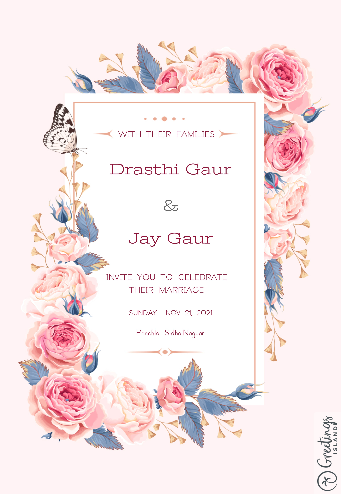

<p align="center"><a href="https://jaygaur7.github.io/Wedding-Invitation-/"></a></p>
<h1 align="center"><a href="https://jaygaur7.github.io/Wedding-Invitation-/">Wedding Invitation</a> :ring: <br> <br> SAVE THE DATE: NOV 21, 2021 <br> <a href="https://jaygaur7.github.io/Wedding-Invitation-/">Drasthi&Jay.jaygaur7.github.io</a></h1>

 [](https://github.com/jaygaur7/Wedding-Invitation-)

## Wedding Invitation :ring:

<details>
  <summary><strong>View Invitation</strong></summary>
  <a href="https://jaygaur7.github.io/Wedding-Invitation-/"></a>
</details>

With the divine grace of the almighty,
inviting you and your family to Jay & Drasthi wedding to be held on **21st November at [Nokha](https://www.google.com/maps/place/Nokha/@27.552223,73.4699813,17z/data=!3m1!4b1!4m5!3m4!1s0x396aa962dc0fef7d:0x799c90a213e4d9d1!8m2!3d27.5522791!4d73.4721366) from 7:00 PM** onwards.

- [Download](https://github.com/jaygaur7/Wedding-Invitation-/raw/master/invitation/Drasthi%20%26%20Jay.pdf) the Invitation card

- Find [venue](https://www.google.com/maps/place/Nokha/@27.552223,73.4699813,17z/data=!3m1!4b1!4m5!3m4!1s0x396aa962dc0fef7d:0x799c90a213e4d9d1!8m2!3d27.5522791!4d73.4721366) on Google map

- Visit the [website](https://jaygaur7.github.io/Wedding-Invitation-/) for more details

```js

const newCouple = 'Drasthi & Jay';

// Nov 21, 2021
const weddingDate = new Date(2021, 11, 21);

// Wedding venue: https://www.google.com/maps/place/Nokha/@27.552223,73.4699813,17z/data=!3m1!4b1!4m5!3m4!1s0x396aa962dc0fef7d:0x799c90a213e4d9d1!8m2!3d27.5522791!4d73.4721366
const weddingVenue = new Location('Nokha');

(function() {
    newCouple.willTieKnot(weddingDate);

    // your presence is requested
    (new Wedding()).acceptInvitation(
        window.open('https://jaygaur7.github.io/Wedding-Invitation-/')
    );
})();


```

## Are you or your loved ones a *bride-to-be* or *groom-to-be*? 
> Feel free to use this template to build your wedding website!

To reuse this, follow the steps:

- *Replace the date in [script.js](https://github.com/jaygaur7/Wedding-Invitation-/blob/master/js/script.js#L29) to have a timer running for your big day!*

```js
// Set the date we're counting down to
var countDownDate = new Date("Nov 21, 2021 00:00:00").getTime();
```

- *If you wish to change the track which plays on click, edit the `src` in [index.html](https://github.com/jaygaur7/Wedding-Invitation-/blob/master/index.html#L69)*

```html
<div class="music">
   <audio src="./assets/mp3/song.mp3" id="my_audio" loop="loop"></audio> 
</div>
```

> <sup>Despite so many new Bollywood and English song options, I prefered to use two-decade-old song, **[Din Shagna Da](https://youtu.be/X0MDALpV29s)**! Ever attended a North Indian Wedding? As soon as the DJ plays [Din Shagna Da](https://youtu.be/Mj4eK5YViCs) song, it means that the much-awaited moment is here and the bride is all set to put her first foot forward to the wedding venue under a breathtaking phoolon ki chaadar. Let's keep the sky-high status of this song untouched! When the website is backed up with a soul-stirring track, the feeling becomes absolutely surreal. **Choose a heart-touching track!** :musical_note: :heart: </sup>


